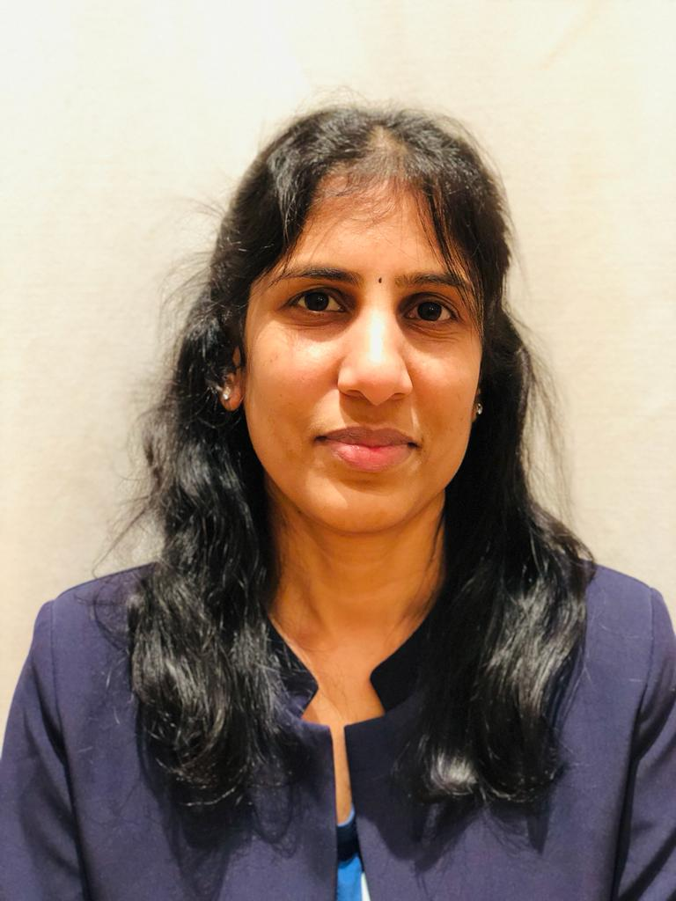

# 💟REKHA SRIRAMAN

## ✋ Hello Everyone, this is Rekha, i am from India. I done my MBA in India

and I have 9+ years of work experience in different filed. And I know little bit
coding

---

I have done my master degree in University of Madras, India.

## 📖 Education

1. MBA

## ⌨️ Technical Skills

I know HTML and CSS. I love to learn coding. I learned these from Youtube. I
jointed the Manual testing and got ISTQB certificate.

1. Basic HTML
2. Basic CSC
3. Manual Testing

## 💻 Work Experience

I was working in the different fields. Now i need to change my career to
software field so that why i joined HYF to know more about coding.

1. Project coordinator
2. Document specialist
3. Inside Sales coordinator

## 💡 Language Skills

- English
- Tamil
- Telugu and
- little bit Dutch

## Contact Details

Phone Number: ☎️ 0465865465

Email Id: 📧 rekha.sri85@gmail.com

Thanks for giving the opportunity 🥰
